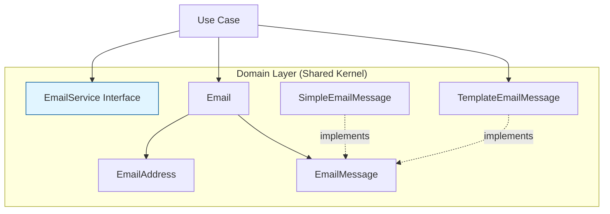

[](https://codecov.io/gh/sitepark/ies-shared-kernel)

# Shared Kernel

The shared kernel contains generic domain models, technical base objects, cross-cutting concerns such as labeling
and data identification (e.g., Anchor, Identifier), and infrastructure-independent annotations for JSON serialization.

## Goal and Benefits

- **Standardization**: Central definition of shared models and policies
- **Consistency**: Clear standards and centralized policies for cross-cutting concerns
- **Reusability**: Avoidance of redundant implementations in individual modules
- **Abstraction**: Provision of abstract interfaces for mechanisms that are independent of specific business logic
- **Infrastructure Independence**: Domain-agnostic annotations that work with any infrastructure implementation

## JSON Serialization Annotations

This module provides annotations for clean JSON serialization patterns:

- **[Unique-Property-Based Polymorphic Deserialization](doc/unique-property-deserialization.md)**
  - Clean polymorphic JSON without type discriminator fields
  - Annotations: `@UseUniquePropertyDeserializer`, `@UniquePropertyType`
  - Use case: Filter DSL, Event Sourcing, Command Pattern

- **[RawJson Annotation](doc/rawjson.md)**
  - Bidirectional conversion between JSON strings and parsed JSON
  - Annotation: `@RawJson`
  - Use case: Flexible schema storage, Event payloads, Audit logging

## Design Principles

- **Cross-Cutting Concern**: Logic that can be used across modules.
- **Abstract Definitions**: Primarily interfaces and abstract classes, with minimal concrete implementations where
  necessary.
- **Domain Objects**: Encapsulation of domain-specific logic and rules to ensure consistency and maintainability. For
  example, the `Anchor` class serves as a domain object that provides a unique identifier with specific validation rules
  and use cases, such as foreign key mapping or ID mappings for data imports.

## Email Template System

This module provides domain models for a template-based email system that enables:

- **Template-Based Emails**: Use Mustache templates with theme support and multi-language capabilities
- **Direct Email Sending**: Send emails with pre-rendered content
- **Theme System**: Apply consistent styling across emails using theme definitions (colors, typography, logos)
- **Multi-Language Support**: Templates with language-specific defaults and content
- **Variable Preprocessing**: Dynamic data structures with theme-based variables

### Core Components



### Email Service

Central interface for sending emails:

```java
public interface EmailService {
  void send(Email email) throws EmailSendException;
  String resolveMessage(String message, Map<String, Object> data);
}
```

### Email Types

**Direct Email (SimpleEmailMessage)**:
```java
SimpleEmailMessage message = new SimpleEmailMessage(
    "Password Reset",
    "<html><body>...</body></html>",
    "Plain text version..."
);
```

**Template-Based Email (TemplateEmailMessage)**:
```java
TemplateEmailMessage message = TemplateEmailMessage.builder()
    .messageType("password-recovery")
    .theme("default")
    .lang("de")
    .data(configurer -> configurer
        .put("subject", "Passwort zurücksetzen")
        .put("code", "123456"))
    .build();
```

### Email Construction

```java
Email email = Email.builder()
    .from(EmailAddress.builder()
        .address("noreply@example.com")
        .name("IES System")
        .build())
    .to(configurer -> configurer.set(
        EmailAddress.builder()
            .address("user@example.com")
            .name("Max Mustermann")
            .build()))
    .message(message)
    .build();

emailService.send(email);
```

### Template System Features

- **Mustache Templates**: Logic-less templates for HTML and plain text
- **Default Data**: Language-specific default values with deep merge support
- **Theme Integration**: Access theme properties (colors, fonts, logos) in templates
- **Variable Preprocessing**: Templates can reference theme properties and dynamic values
- **Format-Specific Processing**: Automatic line break conversion for HTML (`\n` → `<br>`)

The infrastructure implementation (repository interfaces, renderers, theme definitions) is provided in separate modules.

## Usage

To use the shared kernel, include it as a dependency in your module's `pom.xml`:

```xml
<dependency>
    <groupId>com.sitepark.ies</groupId>
    <artifactId>sharedkernel</artifactId>
    <version>1.0.0</version>
</dependency>
